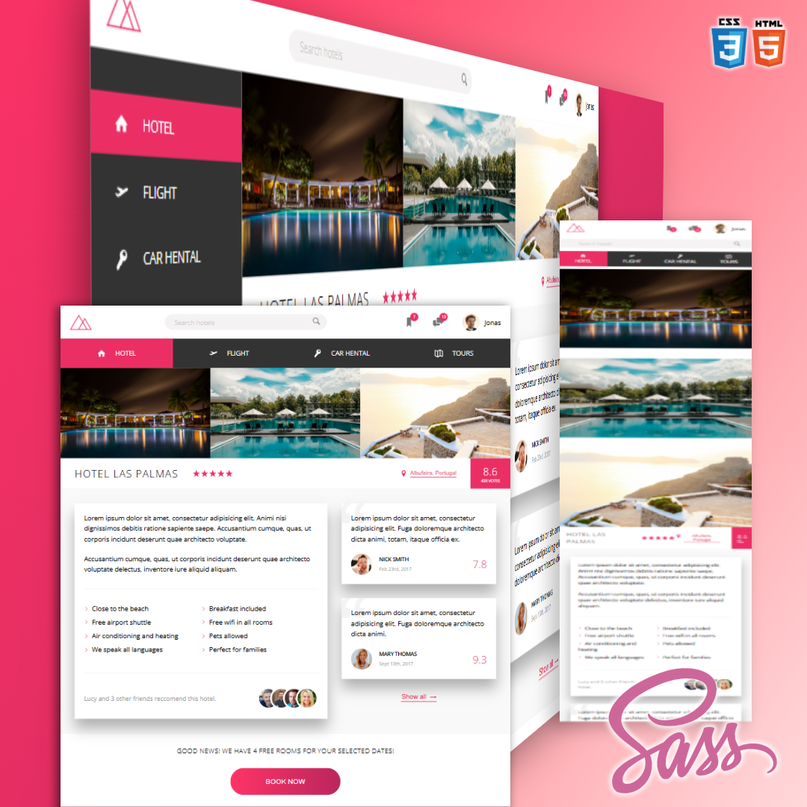
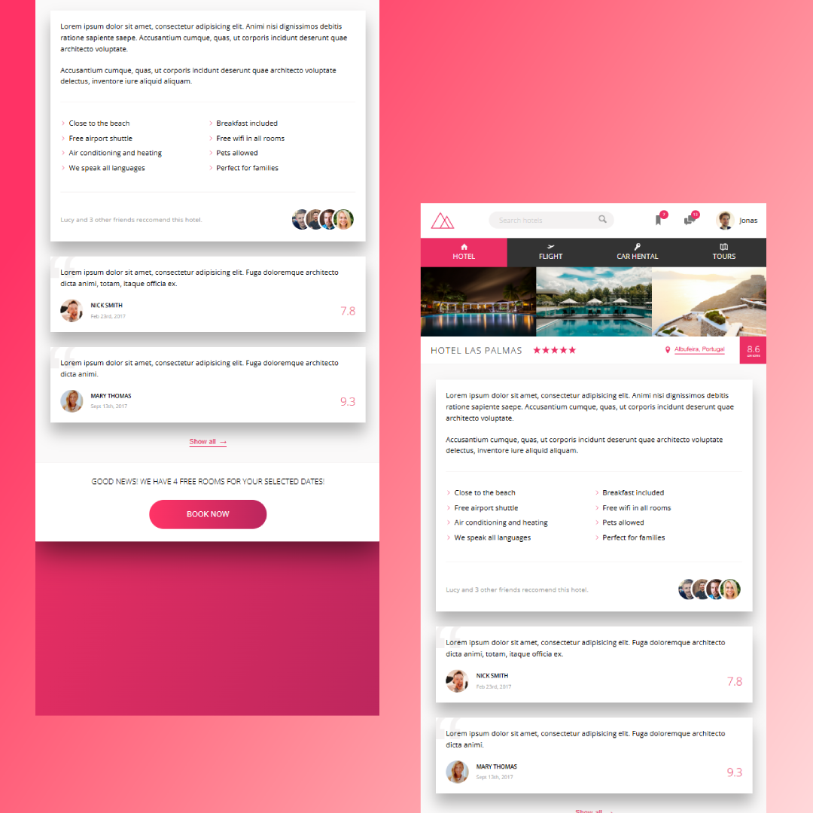

<h1 align="center" style="font-weight: bold;">TRILLO PROJECT - MASTER FLEXBOX!  </h1>

<p align="center">
 <a href="#tech">Technologies</a> • 
 <a href="#started">Getting Started</a> • 
  <a href="#colab">Dedication</a> •

</p>

<p align="center">
    <b>This project was created to showcase the fundamental concepts of the Flexbox layout and its properties, along with custom CSS, masks, and SVGs.</b>
</p>

<p align="center">
     <a href="PROJECT__URL">📱 Visit this Project</a>
</p>

<h2 id="layout">🎨 Layout</h2>

<p align="center">
    
    
</p>

<h2 id="technologies">💻 Technologies</h2>

- HTML5
- CSS3
- SASS

<h2 id="started">🚀 Getting started</h2>

<h3>Prerequisites</h3>

- [NodeJS.v20.19.0](https://nodejs.org/pt/download)

<h3>Cloning</h3>

```bash
git clone https://github.com/gilberto-espinoso/trillo_project.git
```

<h3>Starting</h3>

```bash
cd project-name

npm i
npm run start
```

<h2 id="colab">🤝 Dedication</h2>

I dedicate this project to the instructor and teacher of the **Advanced CSS and Sass: Flexbox, Grid, Animations, and More!** course.

<table>
  <tr>
    <td align="center">
      <a href="#">
        <br>
        <sub>
          <b>Jonas Schmedtmann</b>
        </sub>
      </a>
    </td>
    
   
  </tr>
</table>

<h3>Documentations that might help</h3>

[📝 How to create a Pull Request](https://www.atlassian.com/br/git/tutorials/making-a-pull-request)

[💾 Commit pattern](https://gist.github.com/joshbuchea/6f47e86d2510bce28f8e7f42ae84c716)
